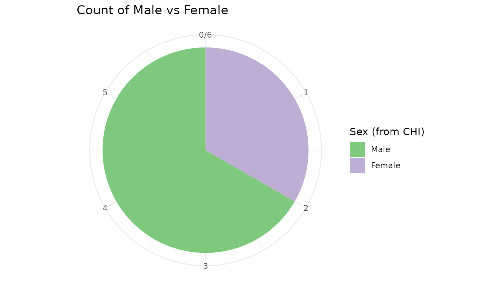

# Working with CHI numbers

## Checking and correcting CHI numbers

The first thing you should do when working with CHI numbers of unknown
quality is to check their validity. phsmethods provides a function to
easily do this:
[`chi_check()`](https://public-health-scotland.github.io/phsmethods/reference/chi_check.md) -
This function expects a character vector (1 or more), it will then
return a value for each CHI number letting you know if it’s valid, and
if it isn’t what the issue is.

``` r
chi_numbers <- c(
  "0211165794",
  "9999999999",
  "402070763",
  "00402070763",
  "0101010000",
  "Missing CHI",
  NA,
  ""
)

library(phsmethods)

chi_check(chi_numbers)
#> [1] "Valid CHI"                    "Invalid date"                
#> [3] "Too few characters"           "Too many characters"         
#> [5] "Invalid checksum"             "Invalid character(s) present"
#> [7] "Missing (NA)"                 "Missing (Blank)"
```

### Cleaning up bad CHI numbers

Usually, we will have the CHI as a variable in some data.

``` r
library(dplyr)

data <- tibble(chi = c(
  "0211165794",
  "9999999999",
  "402070763",
  "00402070763",
  "0101010000",
  "Missing CHI",
  NA,
  ""
))
```

It looks like one of the CHI numbers ‘402070763’ might have just lost a
leading zero, this is a common occurrence if the data has passed through
Excel at some point. We can fix this specific issue with
[`chi_pad()`](https://public-health-scotland.github.io/phsmethods/reference/chi_pad.md).

``` r
fixed_data <- data %>%
  mutate(chi = chi_pad(chi))

checked_data <- fixed_data %>%
  mutate(valid_chi = chi_check(chi))

checked_data
#> # A tibble: 8 × 2
#>   chi           valid_chi                   
#>   <chr>         <chr>                       
#> 1 "0211165794"  Valid CHI                   
#> 2 "9999999999"  Invalid date                
#> 3 "0402070763"  Valid CHI                   
#> 4 "00402070763" Too many characters         
#> 5 "0101010000"  Invalid checksum            
#> 6 "Missing CHI" Invalid character(s) present
#> 7  NA           Missing (NA)                
#> 8 ""            Missing (Blank)
```

On a larger dataset, it might be useful to get a count of the issues
rather than seeing them per CHI.

``` r
fixed_data %>%
  count(valid_chi = chi_check(chi), sort = TRUE)
#> # A tibble: 7 × 2
#>   valid_chi                        n
#>   <chr>                        <int>
#> 1 Valid CHI                        2
#> 2 Invalid character(s) present     1
#> 3 Invalid checksum                 1
#> 4 Invalid date                     1
#> 5 Missing (Blank)                  1
#> 6 Missing (NA)                     1
#> 7 Too many characters              1
```

Now we have this knowledge we have a few options. Which option we take
will depend on the type and purpose of the analysis as well as how many
CHI numbers have issues.

1.  Go back to the data source/provider and try to fix the erroneous CHI
    numbers.
2.  Set them as NA so we keep the rest of the data.
3.  Filter the data with invalid CHIs out completely.

``` r
fixed_data %>%
  mutate(chi = if_else(chi_check(chi) != "Valid CHI", NA_character_, chi))
#> # A tibble: 8 × 1
#>   chi       
#>   <chr>     
#> 1 0211165794
#> 2 NA        
#> 3 0402070763
#> 4 NA        
#> 5 NA        
#> 6 NA        
#> 7 NA        
#> 8 NA

fixed_data %>%
  filter(chi_check(chi) == "Valid CHI")
#> # A tibble: 2 × 1
#>   chi       
#>   <chr>     
#> 1 0211165794
#> 2 0402070763
```

## Inferring data from a CHI number

In an ideal world, we would always have supplementary data such as Date
of Birth, Age and Sex alongside the CHI number, however, we often work
with data where we only have the CHI number and the other demographic
variables are either completely missing or incomplete.

Once we have checked and (if necessary) padded the CHI numbers, we can
then try and extract some information from them.

#### The structure of a CHI number

As explained in this [Wikipedia
article](https://en.wikipedia.org/wiki/National_Health_Service_Central_Register#Community_Health_Index)
a CHI number is constructed as follows: \* The first 6 digits are the
patient’s Date of Birth in the format `DDMMYY`. \* Digits 7 and 8 are
random. \* The 9^(th) number indicates the patient’s sex - odd for male,
even for female. \* The final, 10^(th), digit is a (Modulus-11) ‘check
digit’ - This helps guard against transcription errors, for example, if
someone makes a typo it is very unlikely that the check digit will still
be valid.

### Extracting sex from CHI

With
[`sex_from_chi()`](https://public-health-scotland.github.io/phsmethods/reference/sex_from_chi.md)
we can extract the infer and extract the patient’s sex. By default, the
function will first check the CHI for validity and will return `NA` if a
CHI is invalid.

If you have already checked the CHI in a previous step it can be useful
to use `chi_check = FALSE` as this will be faster.

``` r
data <- tibble(
  chi = c("0101011237", "0211165794", "0402070763", "0101336489", "1904851231", "2902960018")
)

# Confirm all of the CHIs are valid
count(data, chi_check(chi))
#> # A tibble: 1 × 2
#>   `chi_check(chi)`     n
#>   <chr>            <int>
#> 1 Valid CHI            6

data_sex <- data %>%
  mutate(sex = sex_from_chi(chi, chi_check = FALSE))
data_sex
#> # A tibble: 6 × 2
#>   chi          sex
#>   <chr>      <int>
#> 1 0101011237     1
#> 2 0211165794     1
#> 3 0402070763     2
#> 4 0101336489     2
#> 5 1904851231     1
#> 6 2902960018     1
```

By default sex will be returned as an integer with ‘1’ representing
‘Male’ and ‘2’ representing ‘Female’, this is consistent with the
[coding of
sex](https://www.ndc.scot.nhs.uk/Dictionary-A-Z/Definitions/index.asp?Search=S&ID=1277&Title=Sex)
in other PHS datasets.

We can have sex returned as a factor using `as_factor = TRUE`, which by
default will have levels of ‘1’ and ‘2’ and labels of ‘Male’ and
‘Female’ which can be useful, particularly when visualising the data.

``` r
data_sex <- data_sex %>%
  mutate(sex_factor = sex_from_chi(chi, as_factor = TRUE))

data_sex
#> # A tibble: 6 × 3
#>   chi          sex sex_factor
#>   <chr>      <int> <fct>     
#> 1 0101011237     1 Male      
#> 2 0211165794     1 Male      
#> 3 0402070763     2 Female    
#> 4 0101336489     2 Female    
#> 5 1904851231     1 Male      
#> 6 2902960018     1 Male
```

``` r
library(ggplot2)

data_sex %>%
  ggplot(aes(y = "", fill = sex_factor)) +
  geom_bar() +
  coord_polar() +
  labs(title = "Count of Male vs Female", x = "", y = "") +
  scale_fill_brewer("Sex (from CHI)", type = "qual") +
  theme_minimal()
```



### Extracting Date of Birth from CHI

It is usually not possible to definitively infer a patient’s Date of
Birth from the CHI number, this is because the CHI only contains 2
digits for the year. Looking at the first 6 digits of a CHI number
‘010120’ could be ‘1 January 1920’ or ‘1 January 2020’. However, with
some extra context, we can usually eliminate one of the possibilities,
for example in 2023 we know that any CHI numbers of the form ‘DDMM24’
etc. must mean 1924 since it can’t be 2024.

The function
[`dob_from_chi()`](https://public-health-scotland.github.io/phsmethods/reference/dob_from_chi.md)
will try to extract the Date of Birth and will return `NA` if the date
is ambiguous.

``` r
data_dob <- data %>%
  mutate(dob = dob_from_chi(chi))
#> ! 3 CHI numbers produced ambiguous dates and will be given "NA" for their Dates
#>   of Birth.
#> ✔ Try different values for `min_date` and/or `max_date`.

data_dob
#> # A tibble: 6 × 2
#>   chi        dob       
#>   <chr>      <date>    
#> 1 0101011237 NA        
#> 2 0211165794 NA        
#> 3 0402070763 NA        
#> 4 0101336489 1933-01-01
#> 5 1904851231 1985-04-19
#> 6 2902960018 1996-02-29
```

We will need to provide some more context to be able to work out the
still missing dates. Often we will be working with historical data, for
instance, if we know the data is from 2015 we know the patients must
have been born earlier than that. We can use the `min_date` and
`max_date` arguments to provide this context.

- `min_date` will usually be some information from the data, it is the
  latest possible date that the CHI could have been born.
- `max_date` will default to today’s date, it will usually be some
  common sense date about the latest date you’d expect. For instance, if
  working with childhood vaccine data you could use
  `Sys.Date() - lubridate::years(16)`, it to imply you don’t expect
  anyone older than 16 as of today’s date.

``` r
# Expect no one born after 2015-12-31
data %>%
  mutate(dob = dob_from_chi(chi, max_date = as.Date("2015-12-31")))
#> ! 2 CHI numbers produced ambiguous dates and will be given "NA" for their Dates
#>   of Birth.
#> ✔ Try different values for `min_date` and/or `max_date`.
#> # A tibble: 6 × 2
#>   chi        dob       
#>   <chr>      <date>    
#> 1 0101011237 NA        
#> 2 0211165794 1916-11-02
#> 3 0402070763 NA        
#> 4 0101336489 1933-01-01
#> 5 1904851231 1985-04-19
#> 6 2902960018 1996-02-29

# Expect no one born before 1999-12-31 i.e. 16 years before our data started.
data %>%
  mutate(dob = dob_from_chi(
    chi,
    max_date = as.Date("2015-12-31"),
    min_date = as.Date("2015-12-31") - lubridate::years(16)
  ))
#> ! 4 CHI numbers produced ambiguous dates and will be given "NA" for their Dates
#>   of Birth.
#> ✔ Try different values for `min_date` and/or `max_date`.
#> # A tibble: 6 × 2
#>   chi        dob       
#>   <chr>      <date>    
#> 1 0101011237 2001-01-01
#> 2 0211165794 NA        
#> 3 0402070763 2007-02-04
#> 4 0101336489 NA        
#> 5 1904851231 NA        
#> 6 2902960018 NA
```

Usually, we will have event dates e.g. an admission date alongside the
data and this can be used instead of, or in conjunction with a fixed
date.

``` r
data <- data %>%
  mutate(event_date = as.Date(c(
    "2015-01-01",
    "2014-01-01",
    "2013-01-01",
    "2012-01-01",
    "2011-01-01",
    "2010-01-01"
  )))

# Using the event date as the maximum date
data %>%
  mutate(dob = dob_from_chi(chi, max_date = event_date))
#> ! 2 CHI numbers produced ambiguous dates and will be given "NA" for their Dates
#>   of Birth.
#> ✔ Try different values for `min_date` and/or `max_date`.
#> # A tibble: 6 × 3
#>   chi        event_date dob       
#>   <chr>      <date>     <date>    
#> 1 0101011237 2015-01-01 NA        
#> 2 0211165794 2014-01-01 1916-11-02
#> 3 0402070763 2013-01-01 NA        
#> 4 0101336489 2012-01-01 1933-01-01
#> 5 1904851231 2011-01-01 1985-04-19
#> 6 2902960018 2010-01-01 1996-02-29

# Setting a 'fixed' minimum date as well as using the event date
data_dob <- data %>%
  mutate(dob = dob_from_chi(
    chi,
    max_date = event_date,
    min_date = as.Date("1915-01-01")
  ))

data_dob
#> # A tibble: 6 × 3
#>   chi        event_date dob       
#>   <chr>      <date>     <date>    
#> 1 0101011237 2015-01-01 2001-01-01
#> 2 0211165794 2014-01-01 1916-11-02
#> 3 0402070763 2013-01-01 2007-02-04
#> 4 0101336489 2012-01-01 1933-01-01
#> 5 1904851231 2011-01-01 1985-04-19
#> 6 2902960018 2010-01-01 1996-02-29
```

### Extracting age from CHI

The function
[`age_from_chi()`](https://public-health-scotland.github.io/phsmethods/reference/age_from_chi.md)
provides a simpler interface for just extracting a patient’s age from
the CHI number. In the background, it uses
[`dob_from_chi()`](https://public-health-scotland.github.io/phsmethods/reference/dob_from_chi.md)
but allows you to specify `min_age` and `max_age`, which are usually
conceptually simpler than trying to work out dates. We do lose some
amount of fine control here though, so it will sometimes be necessary to
use
[`dob_from_chi()`](https://public-health-scotland.github.io/phsmethods/reference/dob_from_chi.md)
and then
[`age_calculate()`](https://public-health-scotland.github.io/phsmethods/reference/age_calculate.md).

Note that age is calculated at *today’s* date unless otherwise specified
with the `ref_date` argument.

``` r
data %>%
  mutate(age = age_from_chi(chi))
#> ! 3 CHI numbers produced ambiguous dates and will be given "NA" for their Dates
#>   of Birth.
#> ✔ Try different values for `min_age` and/or `max_age`.
#> # A tibble: 6 × 3
#>   chi        event_date   age
#>   <chr>      <date>     <dbl>
#> 1 0101011237 2015-01-01    NA
#> 2 0211165794 2014-01-01    NA
#> 3 0402070763 2013-01-01    NA
#> 4 0101336489 2012-01-01    93
#> 5 1904851231 2011-01-01    40
#> 6 2902960018 2010-01-01    29

# Work out age at a fixed date
data %>%
  mutate(age = age_from_chi(chi, ref_date = as.Date("2016-01-01")))
#> ! 2 CHI numbers produced ambiguous dates and will be given "NA" for their Dates
#>   of Birth.
#> ✔ Try different values for `min_age` and/or `max_age`.
#> # A tibble: 6 × 3
#>   chi        event_date   age
#>   <chr>      <date>     <dbl>
#> 1 0101011237 2015-01-01    NA
#> 2 0211165794 2014-01-01    99
#> 3 0402070763 2013-01-01    NA
#> 4 0101336489 2012-01-01    83
#> 5 1904851231 2011-01-01    30
#> 6 2902960018 2010-01-01    19

# Work out age at a relative date
data %>%
  mutate(age = age_from_chi(chi, ref_date = event_date))
#> ! 2 CHI numbers produced ambiguous dates and will be given "NA" for their Dates
#>   of Birth.
#> ✔ Try different values for `min_age` and/or `max_age`.
#> # A tibble: 6 × 3
#>   chi        event_date   age
#>   <chr>      <date>     <dbl>
#> 1 0101011237 2015-01-01    NA
#> 2 0211165794 2014-01-01    97
#> 3 0402070763 2013-01-01    NA
#> 4 0101336489 2012-01-01    79
#> 5 1904851231 2011-01-01    25
#> 6 2902960018 2010-01-01    13
```

We will get different results depending on which context we supply.

``` r
data %>%
  mutate(age = age_from_chi(chi, ref_date = event_date, max_age = 18))
#> ! 3 CHI numbers produced ambiguous dates and will be given "NA" for their Dates
#>   of Birth.
#> ✔ Try different values for `min_age` and/or `max_age`.
#> # A tibble: 6 × 3
#>   chi        event_date   age
#>   <chr>      <date>     <dbl>
#> 1 0101011237 2015-01-01    14
#> 2 0211165794 2014-01-01    NA
#> 3 0402070763 2013-01-01     5
#> 4 0101336489 2012-01-01    NA
#> 5 1904851231 2011-01-01    NA
#> 6 2902960018 2010-01-01    13

data %>%
  mutate(age = age_from_chi(
    chi,
    ref_date = event_date,
    min_age = 60,
    max_age = 120
  ))
#> ! 2 CHI numbers produced ambiguous dates and will be given "NA" for their Dates
#>   of Birth.
#> ✔ Try different values for `min_age` and/or `max_age`.
#> # A tibble: 6 × 3
#>   chi        event_date   age
#>   <chr>      <date>     <dbl>
#> 1 0101011237 2015-01-01   114
#> 2 0211165794 2014-01-01    97
#> 3 0402070763 2013-01-01   105
#> 4 0101336489 2012-01-01    79
#> 5 1904851231 2011-01-01    NA
#> 6 2902960018 2010-01-01    NA

data %>%
  mutate(age = age_from_chi(
    chi,
    min_age = 60,
    max_age = 120
  ))
#> ! 3 CHI numbers produced ambiguous dates and will be given "NA" for their Dates
#>   of Birth.
#> ✔ Try different values for `min_age` and/or `max_age`.
#> # A tibble: 6 × 3
#>   chi        event_date   age
#>   <chr>      <date>     <dbl>
#> 1 0101011237 2015-01-01    NA
#> 2 0211165794 2014-01-01   109
#> 3 0402070763 2013-01-01   119
#> 4 0101336489 2012-01-01    93
#> 5 1904851231 2011-01-01    NA
#> 6 2902960018 2010-01-01    NA
```
